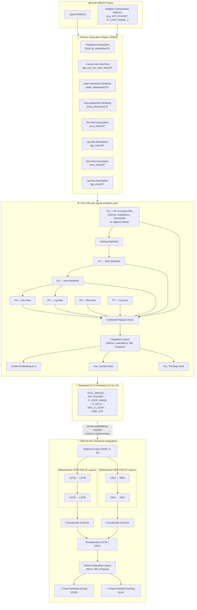

<div align="center">

# 🧬 EGFR-NSCLC Drug Discovery ML Pipeline
## Part A — Dual-SMILES Activity & Docking-Score Prediction

### Predicting 4th-Generation EGFR Inhibitor Activity Against Non-Small Cell Lung Cancer

[](https://python.org)
[](https://tensorflow.org)
[](https://rdkit.org)
[](https://pytorch.org)
[](#license)

---

*An end-to-end machine learning pipeline featuring **dual-SMILES physicochemical descriptor capture** from both ligand and mutation protein — closing the interaction loop to generate intermolecular, intramolecular, similarity, fingerprint, and custom relationship features from both sides. This enables higher-accuracy prediction of drug activity (IC50) and docking scores for EGFR tyrosine kinase inhibitors targeting resistant NSCLC mutations.*

> **Associated Manuscript:** *"Dual-SMILES Feature Learning with a Hierarchical Gated Recurrent Dual KAN Network Architecture for Mutation Informed Activity Prediction of EGFR Tyrosine Kinase Inhibitors"*

</div>

---

## 📋 Table of Contents

- [This Is Part A of a Three-Part Pipeline](#this-is-part-a-of-a-three-part-pipeline)
- [Overview](#overview)
- [Motivation & Background](#motivation--background)
- [Architecture](#architecture)
  - [PHG-NN: Priority Hierarchical Gated Neural Network](#phg-nn-priority-hierarchical-gated-neural-network)
  - [RBLGS-NN: Recurrent Bidirectional LSTM–GRU Sequential Neural Network](#rblgs-nn-recurrent-bidirectional-lstmgru-sequential-neural-network)
- [Feature Engineering — End-to-End Dual-SMILES Descriptor Engine](#feature-engineering--end-to-end-dual-smiles-descriptor-engine)
- [Model Architectures](#model-architectures)
- [Datasets](#datasets)
- [Training & Inference Strategy](#training--inference-strategy)
- [Repository Structure](#repository-structure)
- [Installation & Dependencies](#installation--dependencies)
- [Usage](#usage)
- [Results](#results)
- [Assumptions & Limitations](#assumptions--limitations)
- [Related Repositories](#related-repositories)
- [References](#references)
- [Acknowledgements](#acknowledgements)

---

## This Is Part A of a Three-Part Pipeline

This repository is **Part A** of a three-part drug discovery pipeline targeting 4th-generation EGFR tyrosine kinase inhibitor (TKI) candidates for resistant Non-Small Cell Lung Cancer (NSCLC). The three parts were originally developed together and have since been split into three dedicated repositories that remain functionally connected — outputs and structures from Parts B and C feed directly into the models trained here.

| Part | Repository | Role |
|---|---|---|
| **A (this repo)** | `AI-ML-Drug-Discovery-Pipeline-for-EGFR-TKI-lung-cancer-Mutation-Informed-Dual-SMILES` | **Activity & docking-score prediction.** Dual-SMILES feature engineering + 4 neural network architectures that predict IC50 activity and docking affinity for any ligand–mutation pair. This is the main modelling engine of the project. |
| **B** | [`AI_ML_biomarker_mutation_specific_egfr_nsclc_docking_binding`](https://github.com/rhubainmageswaran/AI_ML_biomarker_mutation_specific_egfr_nsclc_docking_binding) | **Molecular docking.** AutoDock Vina docking of ligands against PDB and AlphaFold EGFR mutation structures. Produces the docking-score labels used as the auxiliary training target in Part A. |
| **C** | [`AI_ML_lung_ca_egfr_ligand_core_subsituents_fragment_exchange`](https://github.com/rhubainmageswaran/AI_ML_lung_ca_egfr_ligand_core_subsituents_fragment_exchange) | **Ligand generation.** Fragment-exchange generator built on the osimertinib scaffold that proposes novel 4th-generation TKI candidates. Its output SMILES are scored by the models trained in this repository. |

```
        ┌────────────────────┐        ┌────────────────────┐
        │   Part C            │        │   Part B            │
        │   Ligand Generator   │──────▶│   Vina Docking       │
        │   (fragment exchange)│  new   │   (AutoDock Vina)    │
        └────────────────────┘ ligands └──────────┬─────────┘
                    │                              │ docking
           novel candidate SMILES                  │ scores
                    ▼                              ▼
              ┌───────────────────────────────────────────┐
              │              Part A (this repo)              │
              │  Dual-SMILES feature engine + 4 NN models    │
              │  → predicted Activity (IC50) + Docking Score │
              └───────────────────────────────────────────┘
```

---

## Overview

This project is a **drug discovery ML pipeline** for predicting **4th-generation EGFR inhibitor** activity against **Non-Small Cell Lung Cancer (NSCLC)**. It uses molecular data sourced from [ChEMBL](https://www.ebi.ac.uk/chembl/) to train neural networks that predict:

1. **Activity** — IC50 values measuring how potent a drug is against specific EGFR mutations
2. **Docking Score** — how well a drug binds to the EGFR protein across mutation variants

### 🔑 Key Differentiator: End-to-End Dual-SMILES Feature Capture

Unlike ligand-only approaches, this pipeline extracts physicochemical descriptors from **both** the ligand SMILES **and** the mutation protein substructure SMILES. This closes the interaction loop — features are generated from both sides of the binding interaction, enabling the model to learn the **relationship** between a specific ligand and a specific mutation protein pocket, rather than treating the protein as a static label.

```
Ligand SMILES ──→ Ligand Descriptors  ──┐
                                        ├──→ Interaction Features ──→ Neural Network ──→ Prediction
Mutation Protein SMILES ──→ Mutation Descriptors ──┘
                                        │
                            ┌────────────┴────────────┐
                            │  Intermolecular features │
                            │  Intramolecular features │
                            │  Similarity metrics      │
                            │  Fingerprint metrics     │
                            │  Custom relationships    │
                            └─────────────────────────┘
```

This dual-source approach means the model doesn't just learn "what makes a good drug" — it learns **what makes a good drug *for a specific mutation***.

---

## Motivation & Background

EGFR-mutant NSCLC is treated with **tyrosine kinase inhibitors (TKIs)**, but acquired resistance mutations progressively render each generation ineffective:

```
1st/2nd Gen TKIs ──→ Sensitising mutations (del19, L858R)
       ↓ resistance
3rd Gen TKIs (Osimertinib) ──→ T790M gatekeeper mutation
       ↓ resistance
4th Gen TKIs (needed) ──→ C797S mutation (triple mutants: del19/T790M/C797S, L858R/T790M/C797S)
```

First- and second-generation inhibitors provide a median progression-free survival (PFS) of approximately 9–13 months, while osimertinib extends PFS to roughly 10.1 months in the second-line setting and up to 18.9 months first-line. The C797S mutation prevents covalent inhibitor binding and represents the critical new resistance barrier that 4th-generation TKI design must overcome.

This pipeline aims to **accelerate the identification of 4th-generation EGFR-TKI candidates** by:
- Capturing ligand–mutation protein interactions through physicochemical descriptors
- Ranking novel compounds by predicted activity and docking affinity
- Feeding candidate structures from the fragment-exchange generator (Part C) and docking labels from the Vina pipeline (Part B) into a unified prediction engine

---

## Architecture

The Activity Prediction pipeline is built as **two integrated sub-models**, applied per ligand–mutation pair and then across a sequence of protein substructures:

- **PHG-NN — Priority Hierarchical Gated Neural Network:** Processes each ligand–mutation site pair, producing 16-dimensional embeddings via a seven-level priority hierarchy with sigmoid gating. Higher-priority features gate and control the contribution of lower-priority descriptors.
- **RBLGS-NN — Recurrent Bidirectional LSTM–GRU Sequential Neural Network:** Processes the 6-timestep sequence of 16-dim embeddings (one per EGFR substructure site) through parallel BiLSTM and BiGRU paths.



> **Multi-task training objective:** ℒ(θ) = αₐ · MSE(ŷ_activity, yₐ) + α_d · MSE(ŷ_docking, y_d), with αₐ = 1.0 (primary) and α_d = 0.6–0.7 (auxiliary, sourced from Part B). Optimiser: Adam.

### PHG-NN: Priority Hierarchical Gated Neural Network

Assigns priority based on the **input order defined in the model code** — higher-priority inputs gate and control lower-priority inputs via learned sigmoid gates.

| Priority | Feature Input | Variable Name | Dimension | Source | Description |
|:---:|---|---|:---:|---|---|
| **P1 ★ Highest** | Fingerprint Interaction | `final_fp_interaction` | ℝ² | Cross-comparison | Morgan fingerprint Tanimoto & Dice similarity between ligand and mutation SMILES |
| **P1 ★ Highest** | Custom Mix Inter/Intra | `lig_mut_mix_inter_intra` | ℝ⁶ | Combined | Physics-inspired safe-divided ratios, differences, products, and gated combinations of inter/intra features from both sides |
| **P2** | Inter-Interaction Similarity | `inter_interaction` | ℝ¹² | Cross-comparison | 10 hand-crafted molecular interaction terms + cosine similarity & sine dissimilarity between ligand & mutation intermolecular feature vectors |
| **P3** | Intra-Interaction Similarity | `intra_interaction` | ℝ⁵ | Cross-comparison | 3 hand-crafted molecular terms + cosine similarity & sine dissimilarity between ligand & mutation intramolecular feature vectors |
| **P4** | Mut Inter Descriptors | `mut_inter` | ℝ²⁵ | Mutation | H-bond donors/acceptors, partial charges, LogP, PSA, hydrophobic & electrostatic descriptors |
| **P5** | Lig Inter Descriptors | `lig_inter` | ℝ²⁵ | Ligand | H-bond donors/acceptors, partial charges, LogP, PSA, electrostatic descriptors |
| **P6** | Mut Intra Descriptors | `mut_intra` | ℝ²⁵ | Mutation | Rotatable bonds, ring count, aromaticity, sp3 fraction, molecular complexity, conjugation |
| **P7 ☆ Lowest** | Lig Intra Descriptors | `lig_intra` | ℝ²⁵ | Ligand | Rotatable bonds, ring count, aromaticity, sp3 fraction, molecular complexity |

> P1 includes two inputs (Fingerprint + Custom Mix) because both are passed into the first hierarchical block together; the Gating (Sigmoid) block then uses the combined P1 vector to gate every downstream priority level. The **cross-comparison** features (P1–P3) are only possible *because* descriptors are generated from both molecules — this is what closes the ligand–protein interaction loop, which is why they are ranked highest.

#### Hierarchical Substructure Timesteps

Features are generated hierarchically, looping over 6 EGFR substructure **timesteps** representing mechanistically defined structural segments of the kinase domain:

| Timestep | Region | Residues |
|---|---|---|
| t=0 | Full EGFR kinase domain | Full sequence |
| t=1 | ATP-binding pocket | 718–862 |
| t=2 | P-loop / hinge region | 719–724 |
| t=3 | αC-helix | 752–760 |
| t=4 | DFG/A-loop | 857–859 (L858R structural context) |
| t=5 | HRD catalytic motif | 831–839 |

Mutation-specific SMILES were generated from verified PDB amino acid sequences and manually generated mutant sequences; mutations not directly available in the PDB were manually introduced at the respective amino acid positions and validated using UCSF ChimeraX.

### RBLGS-NN: Recurrent Bidirectional LSTM–GRU Sequential Neural Network

Bidirectional LSTM (128→64 units/direction) and Bidirectional GRU (128→64 units/direction) paths run in parallel, each processing the 6-timestep sequence of 16-dim embeddings produced by the PHG-NN. Their 256-dimensional concatenated output passes through Dense Integration Layers (ReLU, BatchNorm, Dropout) to produce the final Activity (IC50) and Docking Score predictions.

---

## Feature Engineering — End-to-End Dual-SMILES Descriptor Engine

The core specialty of this pipeline is its **end-to-end physicochemical descriptor capture from both the ligand and the mutation protein using SMILES**. Both molecules are passed through the same descriptor engine, and the resulting feature vectors are then combined to produce interaction-aware representations.

```
                  ┌─────────────────────┐
Ligand SMILES ───→│  RDKit Descriptors  │───→ Ligand Inter Features (H-bond, charge, LogP, PSA...)
                  │  (same engine)      │───→ Ligand Intra Features (flexibility, rings, complexity...)
                  └─────────────────────┘
                            ↕
                  ┌─────────────────────┐
Mutation SMILES ─→│  RDKit Descriptors  │───→ Mutation Inter Features
                  │  (same engine)      │───→ Mutation Intra Features
                  └─────────────────────┘
                            ↓
            ┌───────────────────────────────────────────────┐
            │            Interaction Feature Layer           │
            │  • Fingerprint overlap (Tanimoto, Dice, MFP)  │
            │  • Custom ratio / diff / product combinations  │
            │  • Inter × Inter similarity                    │
            │  • Intra × Intra similarity                    │
            │  • Mutation inter descriptors                  │
            │  • Ligand inter descriptors                    │
            │  • Mutation intra descriptors                  │
            │  • Ligand intra descriptors                    │
            └───────────────────────────────────────────────┘
                            ↓
                  8 Feature Inputs → PHG-NN
```

> **Disk-backed caching:** RDKit feature computation is cached to disk (`.feature_cache/`) to avoid redundant recomputation across training runs.

---

## Model Architectures

Four neural network architectures are implemented, all sharing the same dual-SMILES feature-generation engine and 6-timestep sequence structure but differing in how the hierarchical (Part 1) and recurrent (Part 2) layers are implemented. Architecture diagrams live in `assets/`.

### 1. Dummy PhysChem (Baseline FFN)

`physicochem_activity_main_optimised/dummy_physchem.py`

Simple multi-layer feed-forward network. Serves as a **structural null comparator** to isolate the contribution of mutation-site SMILES encoding used by the advanced architectures. Mutation identity is encoded solely as a discrete integer label fed into an embedding layer — **no protein substructure SMILES are used**. All 7 mutation-substructure descriptors are taken simultaneously as a flat, non-hierarchical input and passed through a deep MLP (Dense 1024 → 512 → 256 with ReLU, BatchNorm, Dropout). There is no priority gating, no recurrent processing, and no repeated sequence — everything is processed in a single forward pass. Dual linear output heads (activity, docking) with no output bounding are used directly.


### 2. ChemBERTa Cross-Attention (Benchmark)

`physicochem_activity_main_optimised/train_benchmark_chemberta.py`

Integrates **ChemBERTa** (pre-trained transformer for molecular SMILES, 768-dimensional embeddings) with **MultiHeadAttention** cross-attention layers. ChemBERTa embeddings are extracted for the **ligand SMILES only**; mutation identity is differentiated through a categorical one-hot vector — no mutation protein substructure SMILES are encoded. A MultiHead Cross-Attention block uses the ligand embedding as Query and the mutation one-hot as Key/Value, with a residual connection and LayerNormalization (Chem Context block). This cross-attended chemical context enhances the P1 vector in the priority hierarchy. The downstream RBLGS-NN temporal model is identical to the custom hierarchical model below.

> This design intentionally ablates the mutation SMILES encoding, providing evidence for the contribution of the dual-SMILES framework.


### 3. Custom Hierarchical BiLSTM/BiGRU — PHG-NN + RBLGS-NN

`physicochem_activity_main_optimised/adv_physchem_priority_Hierarchical__recurrent_LSTM_GRU.py`

The **core custom model** of the pipeline. Full formal name: **Priority Hierarchical Gated Neural Network + Recurrent Bidirectional LSTM–GRU Sequential Neural Network**. Seven-level priority-based hierarchical gating (Dense + LeakyReLU + Tanh per block; final integration z₀ ∈ ℝ⁶⁸ → Dense(128) → Dense(64) → Dense(32) → 16-dim embedding) feeds the parallel BiLSTM/BiGRU sequential model described above. Optimiser: Adam (η = 3×10⁻³ for the hierarchical stage, η = 1×10⁻³ for the recurrent stage).


### 4. Hierarchical RBF-KAN + FourierKAN — FHRK-RFK

`physicochem_activity_main_optimised/adv_physchem_priority_hierarchical_KAN_RBF_recurrent_LSTM_GRU_fourier.py`

Formal name: **Forward Hierarchical RBF KAN with Recurrent Fourier KAN**. A dual-basis Kolmogorov–Arnold Network variant combining two mathematically distinct representations. This was the **top-performing architecture** for mutation-specific activity correlation (see [Results](#results)).

- **Gaussian RBF KAN (hierarchical stage)** — Replaces all tanh Dense projections within the priority branches of the hierarchical per-site encoder with Gaussian Radial Basis Function layers (G = 20 basis functions, grid [−2.0, +2.0]). Each edge function decomposes into a fixed SiLU linear path plus a locally adaptive non-linear spline path, so out-of-distribution compounds at inference time activate only nearby basis functions, keeping the learned function stable in-distribution.
- **Fourier KAN (recurrent stage)** — FourierKAN layers (G = 5 harmonics, domain [−π, +π]) are interleaved within the BiGRU sequential path at three stages: after BiGRU Layer 1, after BiGRU Layer 2, and following LSTM–GRU concatenation. This captures the quasi-periodic structural modulation that the ordered EGFR mutation-site sequence imposes on the downstream embedding.
- The principled separation of basis-function type by representational scope — locally-supported RBF for per-site physicochemical encoding, globally-supported Fourier for ordered sequential mutation-site signal decomposition — is the central architectural contribution of this variant.


> `assets/KAN_B_spline.png` documents an additional exploratory B-spline KAN basis (see BSRBF-KAN in [References](#references)) evaluated alongside the RBF/Fourier variant during architecture development.

---

## Datasets

### Main Datasets

| Dataset | File | Description | Notes |
|---|---|---|---|
| **Blind Test Set** | `dataset/testset_valid_tki.csv` | Strictly validated drug TKIs held out for evaluation (n = 372) | Included in this repository |
| **Combined Training Set** | `trainset_valid_n_nonvalid_tki.csv` | Broad non-validated + injected validated corpus (n = 2,799) | Hosted externally — see `dataset/link_to_train_non_valid_tki_n_df_nondrug_tki.csv.md` due to file size; download and place alongside the training script |

### Dataset Curation Process

Sourced from **ChEMBL** and filtered through a rigorous pipeline. Prior studies have shown that up to 65% of IC50 pairs from minimally curated ChEMBL datasets differ by more than 0.3 log units, underscoring the importance of careful curation.

```
ChEMBL Raw Data
  ├── Filter by Standard Type: Keep IC50, EC50, GI50 (activity measures)
  ├── Filter by Target: EGFR on-target only (discard ADME, off-target)
  ├── Filter by Organism: Homo sapiens (+ Mus musculus for validated set only)
  ├── Filter by Units: nM only
  ├── Remove extreme outliers: IC50 > 10,000 nM and missing values excluded
  ├── Remove salt forms from SMILES
  ├── Categorise mutations by TKD type:
  │     del19, L858R, T790M, C797S, ins20, wild
  │     (single, double, and triple mutant combinations)
  ├── Mutation-specific IC50 stratification (validated corpus only):
  │     Single mutants: ≤100 nM active (erlotinib, gefitinib, afatinib, dacomitinib, osimertinib, lazertinib)
  │     Double mutants: ≤140 nM active (osimertinib, lazertinib only)
  │     Triple mutants: no positive labels assigned (no validated inhibitors exist)
  ├── Manual row-level validation of IC50 ground truth (validated corpus only)
  ├── SMILES format: canonical SMILES (validated corpus); isomeric SMILES (non-validated corpus)
  └── Generate mutation protein SMILES & docking scores (see Part B)
```

Curation notebooks/scripts live in `dataset/curation_scripts/`:

| File | Role |
|---|---|
| `filter_egfr_dataset.py` | Applies the standard-type / target / organism / unit filters described above |
| `eda_osi_cols_filter.ipynb` | Exploratory data analysis and column filtering against the osimertinib-anchored corpus |
| `eda_regex_filter_nov_2025.ipynb` | Regex-based cleaning pass for SMILES and annotation fields |
| `main_osi_mut_match.ipynb` | Matches curated compounds to mutation labels and generates the mutation-protein SMILES columns |

**Validated Drug TKI Corpus (n = 745 total).** Higher ground-truth confidence, with manual IC50 filtering per mutation type. Each entry was individually validated against assay description, experimental system, mutation annotation, and reported IC50 magnitude. Half of the corpus (n = 373) was injected into the non-validated corpus for ground-truth anchoring during training; the remaining n = 372 is reserved as the strict blind test set (`dataset/testset_valid_tki.csv`).

**Non-Validated TKI Corpus (n = 2,799 training).** Provides broad chemical diversity across non-approved and investigational TKI scaffolds, anchored by the 373 injected validated labels. IC50 values were not individually validated per mutation class, presenting higher label uncertainty but greater scaffold diversity. Ground-truth negative labels include rociletinib, ibrutinib, tigozertinib, crizotinib, ceritinib, brigatinib, and dasatinib (IC50 > 100 nM).

### Mutation Protein Substructure SMILES

Both datasets are augmented with **eight protein substructure SMILES columns** representing wild-type, single, double, and triple mutant configurations of the EGFR kinase domain, decomposed into the six mechanistically relevant structural regions listed in [Hierarchical Substructure Timesteps](#hierarchical-substructure-timesteps) above.

### Docking Score as Auxiliary Target

Docking scores for each mutant protein were obtained using AutoDock Vina in **Part B**, following protein retrieval and preparation from the PDB. The optimised docking score is the average of results from experimentally resolved PDB structures and AlphaFold-predicted models. See the [Part B repository](https://github.com/rhubainmageswaran/AI_ML_biomarker_mutation_specific_egfr_nsclc_docking_binding) for the full structure list and docking methodology.

---

## Training & Inference Strategy

The two datasets form a **bidirectional transfer evaluation** strategy. The limitations of each dataset are structurally complementary: the validated corpus's high fidelity but small size is compensated by the non-validated corpus's chemical breadth; the non-validated corpus's lower label confidence is anchored by the validated corpus's clinically-validated ground truth.

| Run | Training Data | Evaluation Data | Train N | Eval N |
|---|---|---|:---:|:---:|
| **Run 1** (primary) | Combined non-validated set | Blind test set (`testset_valid_tki.csv`) | 2,799 | 372 |
| **Run 2** (reversed) | Validated drug TKI split | Combined non-validated set | 373 | 2,799 |

> Run 1 tests generalisation from broad chemical space to curated clinical compounds. Run 2 tests generalisation from validated anchors to a structurally diverse inference library. Results were aggregated over **five independent runs with different random seeds** for robustness (per-seed results available on request — see `assets/results.txt`).

Each run produces: trained model weights (`.h5`), feature scalers (`.pkl`), training/validation loss curves, and prediction CSVs with activity and docking-score estimates, saved to the `experiment_results/` folder created at runtime.

---

## Repository Structure

```
AI-ML-Drug-Discovery-Pipeline-for-EGFR-TKI-lung-cancer-Mutation-Informed-Dual-SMILES/
│
├── 📁 physicochem_activity_main_optimised/
│   ├── dummy_physchem.py                                              # Model 0 — Baseline FFN (train)
│   ├── predict_dummy_physchem_updated.py                              # Model 0 — Baseline FFN (predict)
│   ├── train_benchmark_chemberta.py                                   # Model 1 — ChemBERTa Cross-Attention (train)
│   ├── predict_benchmark_chemberta.py                                 # Model 1 — ChemBERTa Cross-Attention (predict)
│   ├── adv_physchem_priority_Hierarchical__recurrent_LSTM_GRU.py      # Model 2 — PHG-NN + RBLGS-NN (train)
│   ├── predict_adv_physchem_priority_Hierarchical__recurrent_LSTM_GRU.py   # Model 2 — PHG-NN + RBLGS-NN (predict)
│   ├── adv_physchem_priority_hierarchical_KAN_RBF_recurrent_LSTM_GRU_fourier.py       # Model 3 — FHRK-RFK KAN (train)
│   └── predict_adv_physchem_priority_hierarchical_KAN_RBF_recurrent_LSTM_GRU_fourier.py  # Model 3 — FHRK-RFK KAN (predict)
│
├── 📁 dataset/
│   ├── testset_valid_tki.csv                                          # Blind test set (n = 372)
│   ├── link_to_train_non_valid_tki_n_df_nondrug_tki.csv.md            # External download link for the large combined training set
│   └── 📁 curation_scripts/
│       ├── filter_egfr_dataset.py
│       ├── eda_osi_cols_filter.ipynb
│       ├── eda_regex_filter_nov_2025.ipynb
│       └── main_osi_mut_match.ipynb
│
├── 📁 assets/
│   ├── dummy.png                     # Model 0 architecture diagram
│   ├── chemberta_benchmark.png       # Model 1 architecture diagram
│   ├── 5f2.png                       # Model 2 architecture diagram
│   ├── KAN_rbf_navier.png            # Model 3 architecture diagram
│   ├── KAN_B_spline.png              # Exploratory B-spline KAN diagram
│   └── results.txt                   # Notes on per-seed result availability
│
└── README.md
```

---

## Installation & Dependencies

### Core Dependencies

```bash
# Core scientific stack
pip install numpy pandas scikit-learn matplotlib seaborn

# Cheminformatics
pip install rdkit-pypi

# Deep learning
pip install tensorflow>=2.0
pip install torch torchvision

# Logging
pip install loguru
```

### Model-Specific Dependencies

```bash
# For the ChemBERTa Cross-Attention model
pip install transformers
```

### Optional Tools (for structure preparation shared with Part B)

- [UCSF ChimeraX](https://www.cgl.ucsf.edu/chimerax/) — Protein visualisation, preparation, and AlphaFold structure validation
- [PyMOL](https://pymol.org/) — Molecular visualisation

---

## Usage

### 1. Download the training dataset

The large combined training set is hosted externally due to GitHub file-size limits. Follow the link in `dataset/link_to_train_non_valid_tki_n_df_nondrug_tki.csv.md`, download `trainset_valid_n_nonvalid_tki.csv`, and place it in the same directory as the training script you intend to run (`physicochem_activity_main_optimised/`).

### 2. Train a model

Training scripts read their configuration from constants at the top of the file (no CLI flags) and expect the training CSV alongside the script:

```bash
cd physicochem_activity_main_optimised

# Baseline
python dummy_physchem.py

# ChemBERTa Cross-Attention benchmark
python train_benchmark_chemberta.py

# Custom Hierarchical BiLSTM/BiGRU (PHG-NN + RBLGS-NN)
python adv_physchem_priority_Hierarchical__recurrent_LSTM_GRU.py

# FHRK-RFK (KAN RBF + Fourier)
python adv_physchem_priority_hierarchical_KAN_RBF_recurrent_LSTM_GRU_fourier.py
```

### 3. Run predictions (inference)

Prediction scripts take explicit CLI arguments:

```bash
python physicochem_activity_main_optimised/predict_adv_physchem_priority_Hierarchical__recurrent_LSTM_GRU.py \
    --input dataset/testset_valid_tki.csv \
    --model_dir physicochem_activity_main_optimised \
    --output_dir ./predictions
```

The same `--input / --model_dir / --output_dir` pattern applies to `predict_dummy_physchem_updated.py`, `predict_benchmark_chemberta.py`, and `predict_adv_physchem_priority_hierarchical_KAN_RBF_recurrent_LSTM_GRU_fourier.py`.

### 4. Score candidates from Part C

To evaluate novel ligands produced by the [Part C fragment-exchange generator](https://github.com/rhubainmageswaran/AI_ML_lung_ca_egfr_ligand_core_subsituents_fragment_exchange), pass its exported CSV (default `osimertinib_analogs.csv`) as `--input` to any prediction script above, after adding the required mutation-substructure SMILES columns.

---

## Results

Four model architectures were evaluated across two experimental directions, aggregated over **five independent runs with different random seeds**. Models were assessed by MAE, RMSE, and Pearson correlation coefficient (r) across eight EGFR mutation classes.

### Key Findings

**Activity predictions show significant per-mutation correlations.** The FHRK-RFK (KAN RBF+Fourier) architecture was the **only architecture** to achieve a statistically significant overall Pearson correlation in Run 1 (r = 0.356, p < 0.001, n = 372) and the only model to produce all-positive directional correlations across all eight mutations. Per-mutation highlights:

- Del/T790M double: **r = 0.910** (p = 2.57 × 10⁻⁴, n = 10, \*\*\*)
- Del/T790M/C797S triple: **r = 0.810** (p = 2.55 × 10⁻⁴, n = 15, \*\*\*)
- Ins 20: **r = 0.598** (p = 1.58 × 10⁻³, n = 25, \*\*)
- L858R/T790M double: **r = 0.556** (p = 2.02 × 10⁻¹¹, n = 124, \*\*\*)
- Wild-Type: **r = 0.452** (p = 7.55 × 10⁻⁵, n = 71, \*\*\*)

In the reversed direction (Run 2, n = 2,799), the KAN model demonstrated the most consistent significant positive correlations simultaneously across five mutation classes: Del/T790M (r = 0.600, \*\*\*), Ins 20 (r = 0.500, \*\*\*), L858R/T790M (r = 0.392, \*\*\*), Del/T790M/C797S (r = 0.265, \*\*), and L858R/T790M/C797S (r = 0.252, \*\*\*). Overall KAN r = 0.213 (\*\*\*).

ChemBERTa achieved the highest per-class activity correlation for L858R/T790M double in Run 1 (r = 0.688, \*\*\*), but did not achieve a statistically significant overall result.

**Docking-score predictions yield strong correlations.** All four architectures produced substantially stronger correlations for docking scores than for biological activity, reflecting the more deterministic nature of the molecular docking scoring function. ChemBERTa achieved the highest overall docking correlation in Run 1 (r = 0.758, \*\*\*); the KAN RBF+Fourier model achieved significant positive correlations across seven of eight mutation classes in Run 1 (overall r = 0.737, \*\*\*). In Run 2, ChemBERTa showed the strongest overall docking r = 0.350 (\*\*\*); KAN retained r = 0.183 (\*\*\*).

**Distribution shift and numerical instability.** The Dummy PhysChem baseline exhibited severe numerical instability under distribution shift in Run 2, with MAE values reaching 3.94 × 10⁶ nM for Del/Exon 19 and 4.16 × 10⁵ nM for Wild-Type — demonstrating the necessity of dual-SMILES encoding and the advanced architectures for stable generalisation.

### Run 1 — Activity (IC₅₀, nM), n = 372

| Mutation | N | Dummy MAE | Dummy r | BiLSTM/BiGRU MAE | BiLSTM/BiGRU r | ChemBERTa MAE | ChemBERTa r | KAN MAE | KAN r |
|---|:---:|---:|---:|---:|---:|---:|---:|---:|---:|
| Del (Exon 19) | 52 | 355.5 | 0.169 | 890.2 | -0.005 | 162.0 | 0.019 | 154.0 | **0.219** |
| L858R | 49 | 32.7 | -0.062 | 900.3 | 0.200 | 53.4 | -0.012 | 63.8 | 0.081 |
| Del/T790M | 10 | 2775.7 | 0.583 | 3096.5 | -0.435 | 2815.9 | 0.485 | 2760.4 | **0.910 ★** |
| L858R/T790M | 124 | 1467.5 | 0.565 | 1819.7 | 0.250 | 1451.8 | **0.688 ★** | 1466.2 | 0.556 |
| Del/T790M/C797S | 15 | 2728.5 | 0.727 | 2113.5 | -0.080 | 2705.0 | 0.435 | 2623.5 | **0.810 ★** |
| L858R/T790M/C797S | 26 | 1898.7 | 0.277 | 1692.7 | 0.217 | 1957.3 | -0.055 | 2013.6 | 0.108 |
| Ins 20 | 25 | 891.8 | -0.292 | 1193.9 | -0.040 | 950.6 | -0.041 | 854.1 | **0.598 ★** |
| Wild-Type | 71 | 1161.6 | 0.236 | 1028.2 | -0.177 | 1047.0 | -0.019 | 1136.5 | **0.452 ★** |
| **All (Overall)** | **372** | 1142.1 | 0.087 | 1412.8 | 0.036 | 1098.9 | 0.075 | 1113.7 | **0.356 ★** |

★ = statistically significant (p < 0.01 or better). Full RMSE columns and the Run 2 activity table, plus both Run 1 and Run 2 docking-score tables, are reproduced in the training-script output logs and `experiment_results/` folders generated at runtime.

### Run 1 — Docking Score (kcal/mol), n = 372, Overall

| Model | MAE | RMSE | Pearson r |
|---|---:|---:|---:|
| Dummy PhysChem | 0.28 | 0.36 | 0.792 |
| ChemBERTa | 0.29 | 0.38 | **0.758** |
| BiLSTM/BiGRU | 2.76 | 3.12 | 0.347 |
| KAN RBF+Fourier | 0.30 | 0.42 | 0.737 |

### Run 2 — Docking Score (kcal/mol), n = 2,799, Overall

| Model | MAE | RMSE | Pearson r |
|---|---:|---:|---:|
| Dummy PhysChem | 0.63 | 1.06 | 0.369 |
| ChemBERTa | 0.63 | 1.02 | **0.350** |
| BiLSTM/BiGRU | 0.87 | 1.25 | 0.032 |
| KAN RBF+Fourier | 0.72 | 1.11 | 0.183 |

---

## Assumptions & Limitations

### Modeling Assumptions

| # | Assumption |
|---|---|
| 1 | 1st/2nd generation TKIs effective only on single mutants (del19, L858R) |
| 2 | 3rd generation TKIs effective on single + double mutants (+ T790M) |
| 3 | No existing TKI is effective on triple mutants (del19/T790M/C797S or L858R/T790M/C797S) |
| 4 | Exon 20 insertion mutations are uncertain due to heterogeneous drug sensitivity profiles |
| 5 | Wild-type EGFR activity not assumed; excluded from mutation-specific modeling framework |
| 6 | Docking scores reflect meaningful binding to mutation proteins |
| 7 | Averaging PDB + AlphaFold docking scores reduces uncertainty |
| 8 | Physicochemical descriptors adequately capture intermolecular/intramolecular forces |

### Limitations

| Area | Limitation |
|---|---|
| **Data** | The validated corpus (n = 745) has uneven representation across mutation categories, particularly for less-studied single, double, and triple mutant configurations |
| **Data** | Non-validated TKI dataset has higher label uncertainty — IC50 values not individually validated per mutation class |
| **Data** | User-directed curation introduces potential selection bias; mutation-specific IC50 thresholds encode generation-specific assumptions |
| **Model** | Risk of overfitting on small validated dataset (n = 373 training in Run 2) |
| **Model** | Overlapping representations of bonding forces in descriptor categories; structural overlap inherent in SMILES pairing across mutations |
| **Model** | Framework limited to 1D (SMILES-derived) descriptors; 3D spatial conformations, atomic coordinates, protein dynamics, and solvent effects are not explicitly modelled |
| **Model** | Covariate shift between training and inference distributions can degrade generalisation, particularly for the tanh-based BiLSTM/BiGRU |
| **Docking** | Docking scores (Part B) showed limited mutation-discriminative information relative to IC50-based activity predictions |

---

## Related Repositories

- **Part B — Molecular Docking:** [`AI_ML_biomarker_mutation_specific_egfr_nsclc_docking_binding`](https://github.com/rhubainmageswaran/AI_ML_biomarker_mutation_specific_egfr_nsclc_docking_binding) — produces the docking-score auxiliary target used above.
- **Part C — Ligand Generator:** [`AI_ML_lung_ca_egfr_ligand_core_subsituents_fragment_exchange`](https://github.com/rhubainmageswaran/AI_ML_lung_ca_egfr_ligand_core_subsituents_fragment_exchange) — generates novel candidate ligands scored by the models in this repository.

---

## References

### Journal References

1. Passaro, A.; Jänne, P. A.; Mok, T.; Peters, S. Overcoming Therapy Resistance in EGFR-Mutant Lung Cancer. *Nat. Cancer* 2021, 2 (April). https://doi.org/10.1038/s43018-021-00195-8.
2. Ferro, A.; Marco, G.; Mulargiu, C.; Marino, M.; Pasello, G.; Guarneri, V.; Bonanno, L. The Study of Primary and Acquired Resistance to First-Line Osimertinib to Improve the Outcome of EGFR-Mutated Advanced Non-Small Cell Lung Cancer Patients: The Challenge Is Open for New Therapeutic Strategies. *Crit. Rev. Oncol./Hematol.* 2024, 196 (February), 104295. https://doi.org/10.1016/j.critrevonc.2024.104295.
3. Cherkasov, A.; Muratov, E. N.; Fourches, D.; Varnek, A.; Baskin, I. I.; Cronin, M.; Dearden, J. C.; Gramatica, P.; Martin, Y. C.; Todeschini, R.; Consonni, V.; Kuz, V. E.; Cramer, R. D.; Benigni, R.; Yang, C.; Rathman, J. F.; Terfloth, L.; Gasteiger, J.; Richard, A. M.; Tropsha, A. QSAR Modeling: Where Have You Been? Where Are You Going To? 2013.
4. Admin-, D. Discovery. 2022, No. 10. https://doi.org/10.1016/j.drudis.2022.07.004.
5. Tropsha, A.; Isayev, O.; Varnek, A.; Schneider, G.; Cherkasov, A. Integrating QSAR Modelling and Deep Learning in Drug Discovery: The Emergence of Deep QSAR. https://doi.org/10.1038/s41573-023-00832-0.
6. Ponzoni, I.; Sebastián-pérez, V.; Requena-triguero, C.; Roca, C.; María, J.; Cravero, F.; Díaz, M. F.; Páez, J. A.; Arrayás, R. G. Hybridizing Feature Selection and Feature Learning Approaches in QSAR Modeling for Drug Discovery. 2017, No. April, 1–19. https://doi.org/10.1038/s41598-017-02114-3.
7. Hunter, F. M. I.; Ioannidis, H.; Patr, A.; Bosc, N.; Corbett, S.; Felix, E.; Magarinos, M. P.; Manners, E.; Smit, I. A.; Veij, M. De; Boyle, N. M. O.; Zdrazil, B.; Leach, A. R. Drug and Clinical Candidate Drug Data in ChEMBL. 2025. https://doi.org/10.1021/acs.jmedchem.5c00920.
8. Zdrazil, B. Fifteen Years of ChEMBL and Its Role in Cheminformatics and Drug Discovery. 2025.
9. Landrum, G. A.; Riniker, S. Combining IC50 Or. 2024. https://doi.org/10.1021/acs.jcim.4c00049.
10. Kalliokoski, T.; Kramer, C.; Vulpetti, A.; Gedeck, P. Comparability of Mixed IC50 Data – A Statistical Analysis. 2013, 8 (4). https://doi.org/10.1371/journal.pone.0061007.
11. Mcgaughey, G.; Walters, W. P.; Goldman, B.; Vogt, M. Understanding Covariate Shift in Model Performance. 2025, 5 (May), 1–13.
12. Joshi, A.; Kaushik, V. Insights of Molecular Docking in Autodock-Vina: A Practical Approach. 2021, 9, 1–6.
13. Mey, A. S. J. S.; Gorantla, R. From Proteins to Ligands: Decoding Deep Learning Methods for Binding Affinity Prediction. 2024. https://doi.org/10.1021/acs.jcim.3c01208.
14. Bajusz, D.; Rácz, A.; Héberger, K. Why Is Tanimoto Index an Appropriate Choice for Fingerprint-Based Similarity Calculations? *J. Cheminform.* 2015, 1–13. https://doi.org/10.1186/s13321-015-0069-3.
15. Lecun, Y.; Bengio, Y.; Hinton, G. Deep Learning. 2015. https://doi.org/10.1038/nature14539.
16. Huguenin-dumittan, K. K.; Loche, P.; Haoran, N.; Ceriotti, M. Physics-Inspired Equivariant Descriptors of Nonbonded Interactions. 2023. https://doi.org/10.1021/acs.jpclett.3c02375.
17. Tretiakov, S.; Nigam, A.; Pollice, R. Studying Noncovalent Interactions in Molecular Systems with Machine Learning. 2025. https://doi.org/10.1021/acs.chemrev.4c00893.
18. Li, J.; Cai, R.; Wang, Z.; Sun, Y.; Yang, W.; Hu, Y. PLXFPred: Interpretable Cross-Attention Networks with Hierarchical Fusion of Multi-Modal Features for Predicting Protein–Ligand Interactions and Affinities. 2026, 42 (November 2025), 1–11.
19. Zhu, W.; Zhang, Y.; Zhao, D.; Xu, J.; Wang, L. HiGNN: A Hierarchical Informative Graph Neural Network for Molecular Property Prediction Equipped with Feature-Wise Attention. *J. Chem. Inf. Model.* 2023, 63 (1), 43–55. https://doi.org/10.1021/acs.jcim.2c01099.
20. Lilhore, U. K.; Simiaya, S.; Alhussein, M.; Faujdar, N.; Dalal, S. Optimizing Protein Sequence Classification: Integrating Deep Learning Models with Bayesian Optimization for Enhanced Biological Analysis. 2024.
21. Zarzycki, K. LSTM and GRU Type Recurrent Neural Networks in Model Predictive Control: A Review. *Neurocomputing* 2025, 632 (October 2024).
22. Berglund, M.; Leo, K. Bidirectional Recurrent Neural Networks as Generative Models. 1–9.
23. Liu, Z.; Wang, Y.; Vaidya, S.; Ruehle, F.; Halverson, J.; Soljačić, M. KAN: Kolmogorov–Arnold Networks. 2025, 1–50.
24. Li, L.; Zhang, Y.; Wang, G.; Xia, K. Kolmogorov–Arnold Graph Neural Networks for Molecular Property Prediction. *Nat. Mach. Intell.* 2025. https://doi.org/10.1038/s42256-025-01087-7.
25. Chithrananda, S.; Ramsundar, B. ChemBERTa: Large-Scale Self-Supervised Pretraining for Molecular Property Prediction. 2020, NeurIPS.
26. Praski, M.; Adamczyk, J.; Czech, W. Benchmarking Pretrained Molecular Embedding Models for Molecular Representation Learning.
27. Noviandy, T. R.; Idroes, G. M.; Patwekar, M.; Idroes, R. Fine-Tuning ChemBERTa for Predicting Activity of AXL Kinase Inhibitors in Oncogenic Target Modeling. 2025, 3 (2). https://doi.org/10.61975/gjset.v3i2.98.
28. Bu, Y.; Gao, R.; Zhang, B.; Zhang, L.; Sun, D. CoGT: Ensemble Machine Learning Method and Its Application. 2023. https://doi.org/10.1021/acsomega.3c00160.
29. Yang, K.; Swanson, K.; Jin, W.; Coley, C. W.; Eiden, P.; Guzman-perez, A.; Hopper, T.; Kelley, B.; Mathea, M.; Settels, V.; Jaakkola, T. S.; Jensen, K. F.; Barzilay, R. Analyzing Learned Molecular Representations for Property Prediction. 2019. https://doi.org/10.1021/acs.jcim.9b00237.
30. Genet, R.; Inzirillo, H. TKAN: Temporal Kolmogorov-Arnold Networks. 1–6.
31. Alahakoon, A. M. H. H. Approximate Multiplier Induced Error Propagation in Deep Neural Networks.
32. Chiu, S.; Cheung, S. W.; Braga-neto, U.; Lee, C. S.; Li, R. P. Free-RBF-KAN: Kolmogorov-Arnold Networks with Adaptive Radial Basis Functions for Efficient Function Learning. 2025, 27344 (25), 1–16.
33. Ta, H. BSRBF-KAN: A Combination of B-Splines and Radial Basis Functions in Kolmogorov-Arnold Networks.
34. Imran, A. Al. FourierKAN Outperforms MLP on Text Classification Head Fine-Tuning.
35. Zhang, J.; Fan, Y.; Cai, K.; Wang, K. Kolmogorov-Arnold Fourier Networks. 2024.

### Tools & Libraries

- [RDKit](https://rdkit.org/) — Cheminformatics toolkit
- [TensorFlow](https://tensorflow.org/) / [Keras](https://keras.io/) — Deep learning framework
- [PyTorch](https://pytorch.org/) — GNN and ChemBERTa backend
- [PyTorch Geometric](https://pyg.org/) — Graph neural network library
- [HuggingFace Transformers](https://huggingface.co/seyonec/ChemBERTa-zinc-base-v1) — ChemBERTa model
- [AutoDock Vina](https://vina.scripps.edu/) — Molecular docking (Part B)
- [PePSMI](https://novopro.cn/tools/pepsmi) / [Novopro](https://novopro.cn/) — Peptide SMILES
- [UCSF Chimera](https://www.cgl.ucsf.edu/chimera/) / [PyMOL](https://pymol.org/) — Protein visualisation

---

## Acknowledgements

Special thanks to Arshath for his ML expertise and experience throughout the entire project! (https://github.com/moarshy)

- **Claude AI** and **Antigravity (VS Code)** were used to assist with debugging, model architecture design, hierarchical categorisation, and file operations during code development.
- **ChEMBL** database for providing the molecular bioactivity data.
- **AlphaFold** for predicted protein structures where PDB entries were unavailable.

---

<div align="center">

*Part A of a three-part pipeline built for accelerating 4th-generation EGFR-TKI drug discovery against resistant NSCLC mutations.*

</div>
